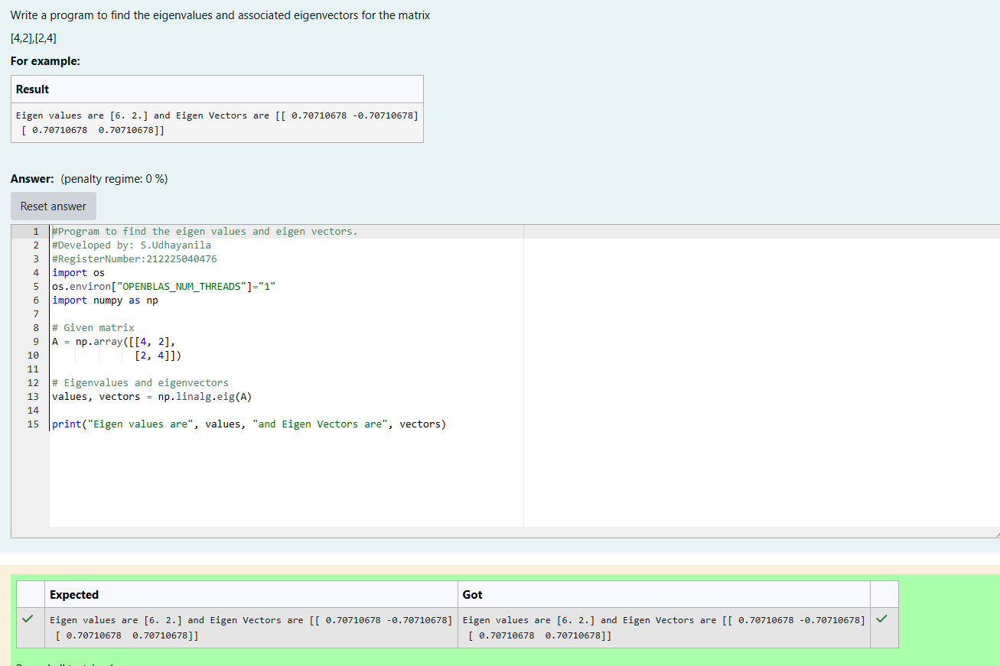

# EIGENVALUES-AND-EIGENVECTORS
## Aim:
To write a python program to find the Eigenvalues and Eigen Vectors
## Equipment’s required:
1. 	Hardware – PCs
2. 	Anaconda – Python 3.7 Installation / Moodle-Code Runner
## Algorithm:
### Step1 : 
### Step 2: 
### Step 3: Using the np.linalg.eig(),  we get two results (first is eigenvalue and second is eigenvector) of the given matrix.
### Step 4: 

## Program:
```
import os
os.environ["OPENBLAS_NUM_THREADS"]="1"
import numpy as np

# Given matrix
A = np.array([[4, 2],
              [2, 4]])

# Eigenvalues and eigenvectors
values, vectors = np.linalg.eig(A)

print("Eigen values are", values, "and Eigen Vectors are", vectors)
```

## Output:

## Result:
Thus the Eigenvalue and Eigenvector is successfully solved using python program
